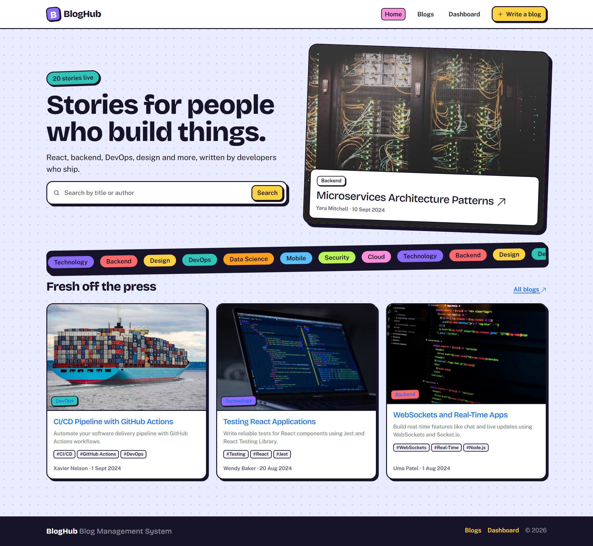
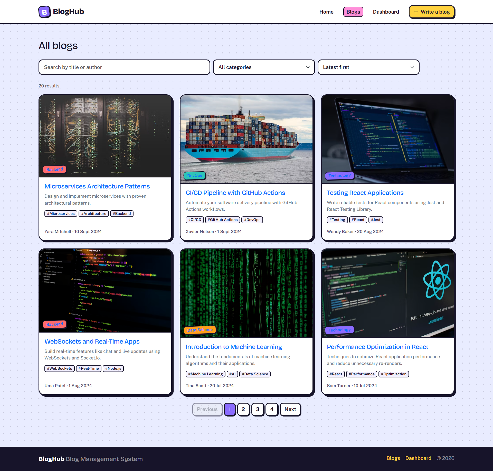
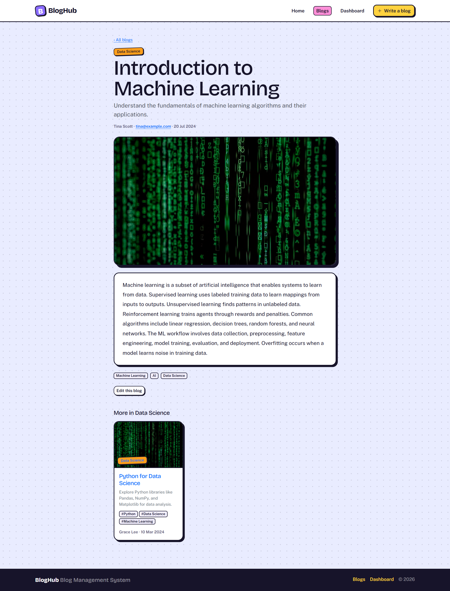
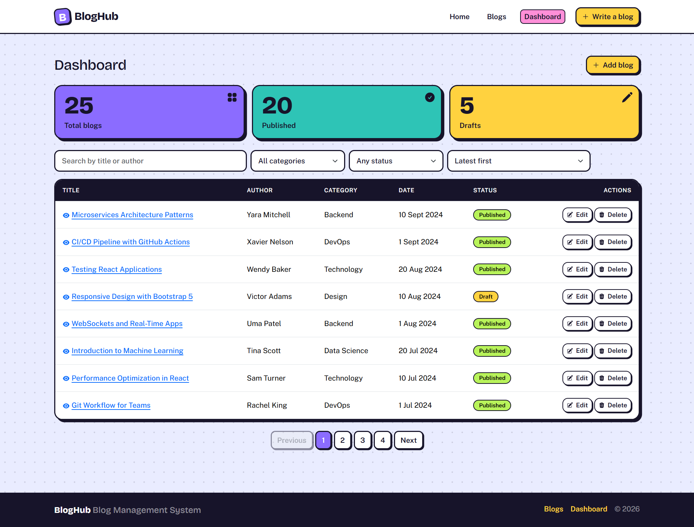
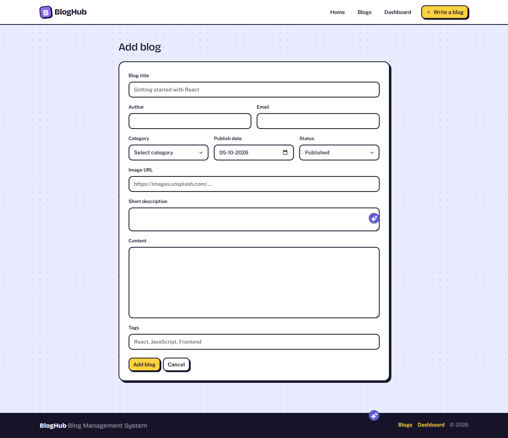

# BlogHub – Blog Management System

BlogHub is a clean, full-stack blog management web app. It features a custom sticker-style design system with smooth animated interactions, full RESTful CRUD capability, local persistence for user preferences, and client-side page routing.

## Screenshots

### 1. Home Page
Overview of featured content, quick action banners, and recent activity.


### 2. Blog List Page
Public directory with full-text search, category tags, sort dropdown, and pagination.


### 3. Blog Details Page
Individual blog view showing full post content, metadata, author details, and related tags.


### 4. Admin Dashboard
Centralized control hub for monitoring metrics (Total, Published, Drafts) and managing post tables.


### 5. Add / Edit Blog Form
Interactive form with real-time field validation for adding and updating posts.


---

## Demo Video

[▶ Watch Project Walkthrough Video](https://drive.google.com/file/d/1U8MAA_AcxKlvC644_oLCCHJyyLVecN20/view?usp=sharing)

---

## How to Run

1. **Clone the repository and install dependencies:**
   ```bash
   npm install